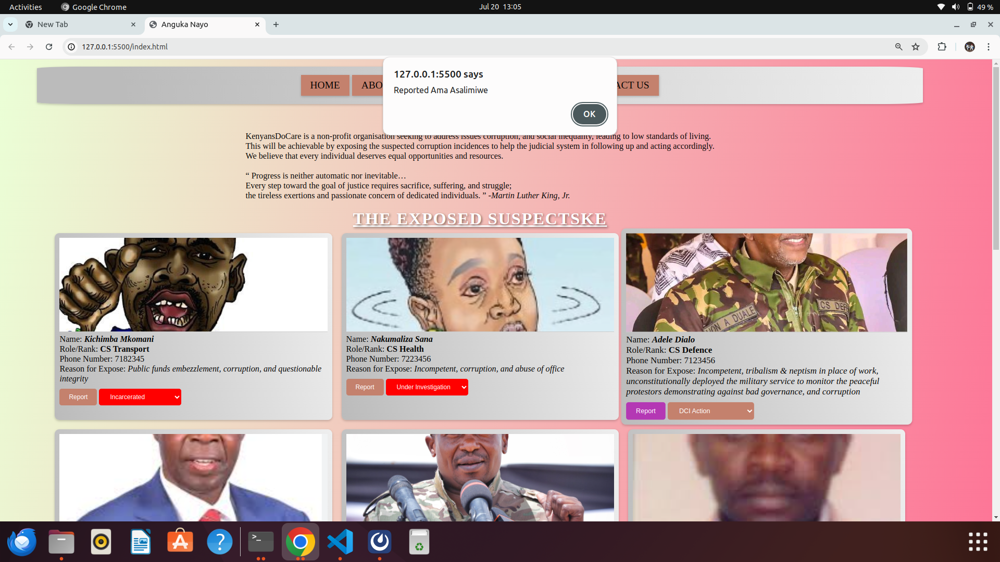

# Assignment: Phase 1 Project

# Presentation Slides

https://docs.google.com/presentation/d/1tooRIUFG6c1p_DCXWFZ9YU1xqvydi6QqXUvWkljD6L0/edit#slide=id.p

## Project Overview

    For this phase 1 project, you're going build a Single Page Application (SPA). Your frontend will be built with HTML, CSS, and JavaScript and will communicate with a public API. The learning goals are
        Integrate JavaScript and an external API
        Debug issues in small- to medium-sized project
    For more instructions refer <https://moringa.instructure.com/courses/776/pages/phase-1-project-guidelines>

# General comments aboute this Programs.

### 1. Preliquisites

    . To run this program, install the latest version of Node.js visual studio editor
    . You can run this program by forking it from github and then you clone it into your repository.
        . To go to your terminal and create a new repository/folder and assign it a name of your choice.
        . A folder in your termainal can be created using the folloing command
                . mkdir kenyansDoCare
        . Secondly, to fork-clone it, go to your browser and paste this libk there https/github.com and login using your github account and if you do not have one, register and configure it ensuring your SSH key is available.
        . Once you are in your git hub click this link https://github.com/Kenedy4/kenyansDoCare-WebApp. while there, you will see a button written "fork":
                 . Click and you will see a green button below it written "Code" and youu will see a link below it, ensure you select the SSH option.
                 . Copy that link and go back to your terminal.
                 . While at your terminal with the current working directory being the one you have previously created in the above step: write git clone the add the SSH link that you had copied from the github.
                 . After the git clone is done, write code . on your terminal and will open your code editor, preferrably Visual Studio.

### 1.1 Running the System Continuation of the Preliquiaites

            . After you have opend the Visual Studio, go back you your terminal and instal json server so that the project can fetch the data from the db.json.
            .To install json server, use the following command on your terminal:
                    < npm install -g json-server >
                    after installing this, you can use the following command to fire the server:
                   json-server --watch db.json
            . Now that you have fired or started the server, click on the html folder `index.html' and then click on the "run" option at the top of the visual studio window.
            . This will launch the webapp on your browser and you should see something like this:

            . Interact with the system try to submit or report an incidence of corruption. You will get a nice response when you click submit or report.

## 2. NOTE:

    This program is not live, however, it is mimicking a judicial system websites that can inform Kenyans on  of the actions taken against criminals vial servants and unscropulous business entities.
    Therefore, this is a static-dynamic system that is cannot store the data in the database,
    hence it is a prototype feature of a system to be developed and deployed later.

## Brief Description of the program

    This is a simple WebApp called kenyansDoCare and it allows youto submit or report an incidence of corruption. Thus, Kenyans can keep government in checks, ensuring accountability, fair and justice is served to all kenyans regardless off their status.

## Purpose and Functionality.

    . A user can view the list of suspected civil servants in Kenya also business entities involved in dirty business activities.
    . This will show them the action taken against these suspects by the Kenyan judicial system: the action could be: reported already, apprehended, incarcenated, or under investigation
    . A user can report incidences of corruption through the provided form at the footer area.
    .The system outo-refresshes once form is submitted .
    .The system fetches data from db.json server using the fecth method

## Application

This ideal for the Kenyan Judicial System as it helps them to convince the Kenyans about the progress of the processes taken or to be taken against suspect.

## License

    This program is licensed under the Apache License Version 2.0, January 2004 <http://www.apache.org/licenses/>
